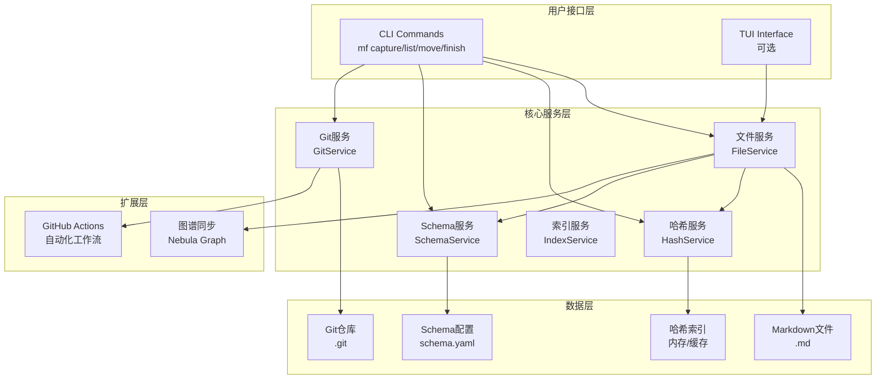

# MemoFlow 设计文档

## 概述 (Overview)

### 项目定义

MemoFlow（记忆流）是一个基于 **Python 3** 构建的命令行/TUI 工作流管理工具，为**会议、笔记、任务和邮件**提供统一管理。系统遵循核心理念：**"快速捕获、清晰组织、经常回顾、有效执行"**。

### 核心技术路线

系统采用以下核心技术架构：

- **存储载体**：**Markdown**（通用、纯文本，人类可读且机器可解析）
- **记忆引擎**：**Git**（版本控制、历史回溯，所有操作自动提交）
- **组织逻辑**：**Johnny.Decimal**（结构化分类，通过 `schema.yaml` 配置驱动）
- **知识扩展**：**Nebula Graph** 接口（支持未来 LLM 知识交互，可选）

### 关键增强特性

基于基础架构，MemoFlow 引入两项关键特性以提升系统的易用性与生命力：

1. **易用性提升 (Addressing)**：引入类似 Git 的 **Short Hash (短哈希)** 机制
   - 解决 Johnny.Decimal 长 ID（如 `12.04`）难以记忆和快速输入的问题
   - 通过 Hash 建立对文件的永久索引
   - 使"修改"和"移动"操作不再依赖易变的 ID

2. **自动化增强 (Automation)**：集成 **GitHub Actions**
   - 不仅作为异地备份
   - 利用云端算力定期执行任务（如每日总结、晨间提醒）
   - 实现从"被动记录"到"主动辅助"的转变

### 核心概念

#### 1. 双重索引体系

系统在逻辑层维护两套索引，分别服务于"管理"和"操作"：

- **层级索引 (Classification ID)**：基于 Johnny.Decimal
  - 格式：`{UserPrefix}-{Area}{Category}.{ItemID}`（例如：`HANK-10.11`）
  - 作用：决定文件在物理文件系统（柜子/抽屉）中的位置
  - **可变**：当文件从"Inbox"移动到"项目目录"时，此 ID 改变

- **物理索引 (Object Hash)**：基于 UUID 的短哈希
  - 格式：6 位十六进制字符（例如：`7f9a2b`）
  - 作用：唯一锚定一个文件，用于 CLI 快速操作
  - **不可变**：文件创建即生成，终身伴随，不受重命名或移动影响

#### 2. 记忆即代码 (Memory as Commit)

所有操作（增删改查）均通过 Git 提交记录，Commit Message 需遵循 [Angular Commit Convention](https://www.conventionalcommits.org/)，使历史记录机器可读：

- `feat(7f9a2b)`: 新增/完成（Capture/Engage）
- `refactor(7f9a2b)`: 移动/整理（Organize）
- `docs(7f9a2b)`: 内容更新（Refine）

#### 3. 动态架构 (Dynamic Schema)

- **柜子与抽屉**：支持通过配置文件 (`schema.yaml`) 自定义柜子（Area）和抽屉（Category）的名称与结构，不硬编码
- **标签系统**：支持自定义标签池（`tags.yaml`，可选）

### 设计原则

1. **文件即数据源**：所有数据以 Markdown 文件形式存储，人类可读且机器可解析
2. **Git 作为时间机器**：所有操作自动提交到 Git，提供完整的历史追踪，Commit Message 遵循 Angular Commit Convention
3. **双重索引系统**：短哈希（永久引用，不可变）+ Johnny.Decimal ID（逻辑组织，可变）
4. **配置驱动**：通过 `schema.yaml` 自定义组织结构，避免硬编码
5. **渐进式增强**：核心功能优先，图谱集成和 TUI 作为可选增强

### 技术栈

**核心依赖**：
- **Python 3.9+**：核心运行时
- **Typer** 或 **Click**：CLI 框架（推荐 Typer，支持类型提示）
- **GitPython**：Git 操作封装
- **PyYAML**：Schema 配置解析
- **python-frontmatter**：Markdown frontmatter 处理

**可选依赖**：
- **nebula3-python**：Nebula Graph 客户端（图谱集成）
- **rich**：终端输出美化（TUI 界面）

---

## 架构 (Architecture)

### 系统架构图



### 目录结构

**项目根目录（用户仓库）**：
```
my-second-brain/              # 用户的工作流仓库
├── .mf/                      # MemoFlow 元数据目录
│   ├── hash_index.json       # 哈希索引文件（SSOT）
│   └── logs/                 # 日志目录（可选）
├── .github/
│   └── workflows/
│       ├── morning_wake.yml  # 晨间唤醒工作流
│       └── evening_review.yml # 晚间复盘工作流
├── 00-Inbox/                 # 收件箱（临时文件）
├── 10-20/                    # Area 1 (示例)
│   ├── 10.01-10.09/
│   └── 10.10-10.19/
├── 20-30/                    # Area 2
├── schema.yaml               # Schema 配置
└── tags.yaml                 # 标签池配置（可选）
```

**MemoFlow 包结构（源代码）**：
```
memoflow/                     # Python 包
├── mf/                       # 核心包（简短命名）
│   ├── __init__.py
│   ├── cli.py                # CLI 入口
│   ├── core/                 # 核心服务层
│   │   ├── __init__.py
│   │   ├── hash_manager.py   # Hash 生成与映射
│   │   ├── schema_manager.py # Johnny.Decimal 架构
│   │   ├── git_engine.py     # Git 自动提交引擎
│   │   └── file_manager.py   # Markdown 文件操作
│   ├── commands/             # 命令处理层
│   │   ├── __init__.py
│   │   ├── capture.py        # 捕获命令
│   │   ├── organize.py       # 组织命令（move）
│   │   ├── review.py         # 回顾命令（list, status, timeline）
│   │   └── engage.py         # 执行命令（finish）
│   ├── views/                # 视图层
│   │   ├── __init__.py
│   │   ├── list_view.py      # 列表视图
│   │   ├── status_view.py    # 状态视图
│   │   ├── timeline_view.py  # 时间轴视图
│   │   └── calendar_view.py  # 日历视图
│   ├── models/               # 数据模型
│   │   ├── __init__.py
│   │   ├── memo.py           # Memo 数据模型
│   │   └── schema.py         # Schema 数据模型
│   ├── utils/                # 工具函数
│   │   ├── __init__.py
│   │   ├── markdown.py       # Markdown 处理
│   │   └── jd.py             # Johnny.Decimal 工具
│   └── integrations/         # 集成层
│       ├── __init__.py
│       ├── github_actions.py # GitHub Actions 集成
│       └── nebula_sync.py    # Nebula Graph 同步
├── tests/                    # 测试目录
│   ├── test_hash_manager.py
│   ├── test_file_manager.py
│   ├── test_git_engine.py
│   └── test_commands.py
├── pyproject.toml           # 项目配置
└── README.md
```

---

## 组件和接口 (Components and Interfaces)

### 1. CLI 接口层 (`cli.py`)

**职责**：解析用户命令，调用相应服务，格式化输出

**主要命令**：

```python
# 命令结构
mf capture -t <type> "content"           # 快速捕获
mf list [--tree] [--filter]               # 列表视图
mf status                                 # 状态视图
mf move <hash> <old_path> <new_path>      # 移动文件
mf finish <hash>                          # 完成任务
mf timeline [--since] [--type]            # 时间轴
mf calendar [--month]                     # 日历视图
mf sync-graph                             # 同步图谱
mf ci [--mode morning|evening]            # CI 命令
mf rebuild-index                          # 重建哈希索引
```

**技术选择**：使用 **Typer** 框架（也可使用 Click）

**Typer 实现示例**：

```python
import typer
from typing import Optional
from datetime import datetime

app = typer.Typer()

@app.command()
def capture(
    content: str = typer.Argument(..., help="要捕获的内容"),
    type: str = typer.Option(..., "-t", "--type", help="文件类型"),
):
    """快速捕获: mf capture -t task "Fix bug #123" """
    from mf.commands.capture import handle_capture
    handle_capture(type, content)

@app.command()
def move(
    hash: str = typer.Argument(..., help="文件哈希（支持部分匹配）"),
    old_path: str = typer.Argument(..., help="旧路径（JD ID）"),
    new_path: str = typer.Argument(..., help="新路径（JD ID）"),
):
    """移动文件: mf move 7f9a HANK-00.01 HANK-12.04"""
    from mf.commands.organize import handle_move
    handle_move(hash, old_path, new_path)

@app.command()
def finish(
    hash: str = typer.Argument(..., help="文件哈希"),
):
    """完成任务: mf finish 7f9a"""
    from mf.commands.engage import mark_finished
    mark_finished(hash)

@app.command()
def status():
    """查看状态: mf status"""
    from mf.commands.review import show_status
    show_status()

@app.command()
def timeline(
    since: str = typer.Option("1.week", help="时间范围"),
    type: Optional[str] = typer.Option(None, help="过滤提交类型"),
):
    """时间轴: mf timeline --since 2.weeks"""
    from mf.commands.review import show_timeline
    show_timeline(since, type)

@app.command()
def ci(
    mode: str = typer.Option(..., "--mode", help="模式: morning 或 evening"),
):
    """供 GitHub Actions 调用: mf ci --mode morning"""
    from mf.commands.ci import handle_ci
    handle_ci(mode)

if __name__ == "__main__":
    app()
```

**Click 实现示例**（备选方案）：

```python
import click

@click.group()
def cli():
    """MemoFlow - Your Second Brain"""
    pass

@cli.command()
@click.option('-t', '--type', type=click.Choice(['meeting', 'note', 'task', 'email']))
@click.argument('content')
def capture(type, content):
    """快速捕获: mf capture -t task "Fix bug #123" """
    from mf.commands.capture import handle_capture
    handle_capture(type, content)

@cli.command()
@click.argument('hash')
@click.argument('old_path')
@click.argument('new_path')
def move(hash, old_path, new_path):
    """移动文件: mf move 7f9a HANK-00.01 HANK-12.04"""
    from mf.commands.organize import handle_move
    handle_move(hash, old_path, new_path)

# ... 其他命令
```

**技术选择说明**：
- **Typer**：推荐使用，基于类型提示，代码更简洁，自动生成帮助文档
- **Click**：备选方案，更成熟，社区支持更好，但代码相对冗长

### 2. 文件服务 (`file_manager.py`)

**职责**：Markdown 文件的创建、读取、更新、移动

**核心接口**：

```python
import frontmatter
from datetime import datetime
from pathlib import Path
from typing import List, Optional

class FileManager:
    """文件管理器：Markdown 文件的 CRUD 与 Frontmatter 管理"""
    
    def __init__(
        self,
        repo_root: Path,
        hash_mgr: HashManager,
        schema_mgr: SchemaManager,
        git_engine: GitEngine
    ):
        self.root = repo_root
        self.hash_mgr = hash_mgr
        self.schema_mgr = schema_mgr
        self.git_engine = git_engine
        self.inbox_dir = repo_root / "00-Inbox"
        self.inbox_dir.mkdir(exist_ok=True)
    
    def create_file(
        self,
        file_type: str,
        title: str,
        content: str = "",
        target_dir: Path = None
    ) -> tuple[str, Path]:
        """
        创建文件并返回 (hash, path)
        """
        # 生成 Hash
        hash_id = self.hash_mgr.generate_hash()
        
        # 确定位置 (默认 Inbox)
        if target_dir is None:
            target_dir = self.inbox_dir
        
        # 生成临时 ID
        temp_id = self.schema_mgr.generate_temp_id()
        
        # 构建 Frontmatter
        metadata = {
            'uuid': hash_id,
            'id': temp_id,
            'type': file_type,
            'title': title,
            'status': 'open',
            'created_at': datetime.now().isoformat(),
            'tags': []
        }
        
        # 写入文件
        post = frontmatter.Post(content, **metadata)
        safe_title = self._sanitize_filename(title)
        file_path = target_dir / f"{hash_id}_{safe_title}.md"
        
        with open(file_path, 'w', encoding='utf-8') as f:
            f.write(frontmatter.dumps(post))
        
        # 注册到 Hash Index
        self.hash_mgr.register(hash_id, file_path, temp_id)
        
        # 自动提交
        self.git_engine.auto_commit(
            CommitType.FEAT,
            "new",
            f"capture {title}",
            [file_path]
        )
        
        return hash_id, file_path
    
    def read_file(self, hash: str) -> Memo:
        """通过哈希读取文件"""
        paths = self.hash_mgr.resolve(hash)
        if len(paths) > 1:
            raise ValueError(f"Ambiguous hash '{hash}': {len(paths)} matches")
        
        return Memo.from_file(paths[0])
    
    def move_file(
        self,
        hash_id: str,
        old_path: str,
        new_jd_id: str
    ) -> Path:
        """
        通过 Hash 移动文件到新的 JD 目录
        """
        # 解析文件
        old_paths = self.hash_mgr.resolve(hash_id)
        if len(old_paths) > 1:
            raise ValueError(f"Ambiguous hash: {old_paths}")
        if len(old_paths) == 0:
            raise FileNotFoundError(f"Hash '{hash_id}' not found")
        
        old_path = old_paths[0]
        
        # 验证 old_path 匹配
        memo = Memo.from_file(old_path)
        if memo.id != old_path:
            raise ValueError(f"Old path mismatch: expected {old_path}, got {memo.id}")
        
        # 验证新路径
        if not self.schema_mgr.validate_path(new_jd_id):
            raise ValueError(f"Invalid JD path: {new_jd_id}")
        
        # 更新 Frontmatter
        post = frontmatter.load(old_path)
        post.metadata['id'] = new_jd_id
        
        # 计算新路径
        new_dir = self.schema_mgr.get_directory_path(new_jd_id)
        new_dir.mkdir(parents=True, exist_ok=True)
        new_path = new_dir / old_path.name
        
        # 移动文件
        with open(new_path, 'w', encoding='utf-8') as f:
            f.write(frontmatter.dumps(post))
        old_path.unlink()
        
        # 更新 Hash 索引
        self.hash_mgr.update_path(hash_id, new_path, new_jd_id)
        
        # 自动提交
        self.git_engine.auto_commit(
            CommitType.REFACTOR,
            hash_id,
            f"move from {old_path} to {new_jd_id}",
            [new_path]
        )
        
        return new_path
    
    def update_file(
        self,
        hash_id: str,
        content: str = None,
        frontmatter_updates: dict = None
    ) -> Memo:
        """更新文件内容或 frontmatter"""
        memo = self.read_file(hash_id)
        
        post = frontmatter.load(memo.file_path)
        
        if content is not None:
            post.content = content
        
        if frontmatter_updates:
            post.metadata.update(frontmatter_updates)
        
        with open(memo.file_path, 'w', encoding='utf-8') as f:
            f.write(frontmatter.dumps(post))
        
        # 自动提交
        self.git_engine.auto_commit(
            CommitType.DOCS,
            hash_id,
            "update content",
            [memo.file_path]
        )
        
        return Memo.from_file(memo.file_path)
    
    def _sanitize_filename(self, title: str) -> str:
        """清理文件名，移除非法字符"""
        import re
        safe = re.sub(r'[^\w\s-]', '', title)
        safe = re.sub(r'[-\s]+', '-', safe)
        return safe[:50]  # 限制长度
```

**依赖**：
- `HashManager`：生成和查找哈希
- `SchemaManager`：验证路径有效性
- `GitEngine`：自动提交变更

### 3. 哈希服务 (`hash_manager.py`)

**职责**：生成唯一短哈希，维护哈希到文件的映射

**核心接口**：

```python
import uuid
import json
from pathlib import Path
from typing import Dict, List, Optional

class HashManager:
    """哈希管理器：生成、存储、查询 Short Hash"""
    
    def __init__(self, repo_root: Path):
        self.repo_root = repo_root
        self.index_file = repo_root / ".mf" / "hash_index.json"
        self.index = self._load_index()
    
    def _load_index(self) -> Dict[str, dict]:
        """从文件加载索引，如不存在则返回空字典"""
        if self.index_file.exists():
            with open(self.index_file, 'r', encoding='utf-8') as f:
                return json.load(f)
        return {}
    
    def _save_index(self):
        """保存索引到文件"""
        self.index_file.parent.mkdir(parents=True, exist_ok=True)
        with open(self.index_file, 'w', encoding='utf-8') as f:
            json.dump(self.index, f, indent=2, ensure_ascii=False)
    
    def generate_hash(self) -> str:
        """生成唯一的 6 位十六进制哈希"""
        full_uuid = uuid.uuid4().hex
        short_hash = full_uuid[:6]
        
        # 碰撞检测：如冲突则扩展长度
        length = 6
        while short_hash in self.index:
            length += 1
            short_hash = full_uuid[:length]
            if length > 12:  # 安全限制
                # 重新生成 UUID
                full_uuid = uuid.uuid4().hex
                short_hash = full_uuid[:6]
                length = 6
        
        return short_hash
    
    def register(self, hash_id: str, file_path: Path, jd_id: str = None):
        """注册 Hash 到文件路径的映射"""
        self.index[hash_id] = {
            "path": str(file_path.relative_to(self.repo_root)),
            "id": jd_id,
            "last_updated": datetime.now().isoformat()
        }
        self._save_index()
    
    def resolve(self, partial_hash: str) -> List[Path]:
        """支持部分匹配 (Git-style)，返回匹配的文件路径列表"""
        matches = [
            (h, self.repo_root / info["path"])
            for h, info in self.index.items()
            if h.startswith(partial_hash)
        ]
        
        if len(matches) == 0:
            raise FileNotFoundError(f"Hash '{partial_hash}' not found")
        
        return [path for _, path in matches]
    
    def update_path(self, hash_id: str, new_path: Path, new_jd_id: str = None):
        """文件移动时更新映射"""
        if hash_id in self.index:
            self.index[hash_id]["path"] = str(new_path.relative_to(self.repo_root))
            if new_jd_id:
                self.index[hash_id]["id"] = new_jd_id
            self.index[hash_id]["last_updated"] = datetime.now().isoformat()
            self._save_index()
    
    def rebuild_index(self):
        """重建索引：扫描所有 Markdown 文件"""
        self.index = {}
        for md_file in self.repo_root.rglob("*.md"):
            try:
                memo = Memo.from_file(md_file)
                self.register(memo.uuid, md_file, memo.id)
            except Exception as e:
                # 跳过无法解析的文件
                logger.warning(f"Failed to parse {md_file}: {e}")
        self._save_index()
```

**实现策略**：

1. **哈希生成**：
   - 使用 `uuid.uuid4().hex` 生成 32 位十六进制字符串
   - 取前 6 位作为短哈希
   - 检查唯一性，如冲突则扩展为 7 位、8 位...（最多 12 位）

2. **索引存储**：
   - 使用 `.mf/hash_index.json` 作为单一真相源 (SSOT)
   - 索引格式：`{hash: {path, id, last_updated}}`
   - 每次注册/更新后自动保存

3. **部分匹配**：
   - 支持 Git 风格的短哈希匹配（如 `7f9` 可匹配 `7f9a2b`）
   - 如多个匹配则返回所有匹配项，由调用方处理歧义

4. **性能优化**：
   - 索引文件提供 O(1) 查找性能
   - 启动时按需加载索引
   - 支持手动重建索引（`mf rebuild-index`）

### 4. Schema 服务 (`schema_service.py`)

**职责**：加载和验证 Johnny.Decimal Schema 配置

**核心接口**：

```python
class SchemaService:
    def load_schema(self) -> Schema:
        """加载 schema.yaml，如不存在则创建默认"""
        
    def validate_path(self, path: str) -> bool:
        """验证 Johnny.Decimal 路径是否有效"""
        
    def get_area_name(self, area_id: int) -> str:
        """获取区域名称"""
        
    def get_category_name(self, area_id: int, category_id: int) -> str:
        """获取类别名称"""
        
    def generate_temp_id(self) -> str:
        """生成临时 ID（用于 Inbox）"""
```

**Schema 数据结构**：

```yaml
# schema.yaml
user_prefix: "HANK"
areas:
  - id: 10
    name: "项目"
    categories:
      - id: 1
        name: "规划"
        range: [10.01, 10.09]
      - id: 2
        name: "执行"
        range: [10.10, 10.19]
  - id: 20
    name: "学习"
    categories:
      - id: 1
        name: "阅读"
        range: [20.01, 20.09]
```

### 5. Git 服务 (`git_engine.py`)

**职责**：封装 Git 操作，自动提交变更，遵循 Angular Commit Convention

**核心接口**：

```python
from git import Repo
from enum import Enum
from pathlib import Path
from datetime import datetime
import re

class CommitType(Enum):
    """提交类型枚举"""
    FEAT = "feat"          # 新增捕获/完成任务
    REFACTOR = "refactor"  # 移动/重组
    DOCS = "docs"         # 内容更新
    CHORE = "chore"        # 维护操作

class GitEngine:
    """Git 引擎：封装符合 Angular 规范的 Git 操作"""
    
    def __init__(self, repo_path: Path):
        self.repo_path = repo_path
        self.repo = self._ensure_repo()
    
    def _ensure_repo(self) -> Repo:
        """确保 Git 仓库已初始化"""
        try:
            return Repo(self.repo_path)
        except:
            # 自动初始化
            repo = Repo.init(self.repo_path)
            # 创建初始提交
            repo.index.commit("chore(init): initialize MemoFlow repository")
            return repo
    
    def auto_commit(
        self,
        commit_type: CommitType,
        scope: str,  # Hash ID 或 "new"
        message: str,
        files: List[Path]
    ) -> str:
        """
        自动 Stage + Commit
        格式: feat(7f9a2b): capture new meeting note
        """
        # Stage 文件
        for file in files:
            self.repo.index.add([str(file)])
        
        # 构建 Commit Message
        full_message = f"{commit_type.value}({scope}): {message}"
        
        # Commit
        commit = self.repo.index.commit(full_message)
        return commit.hexsha
    
    def parse_timeline(
        self,
        since: str = "1.week",
        until: datetime = None
    ) -> List[dict]:
        """解析 Git Log 生成时间轴"""
        commits = list(self.repo.iter_commits(f'--since={since}'))
        
        timeline = []
        for commit in commits:
            # 解析 Angular 格式: type(scope): message
            match = re.match(r'(\w+)\(([^)]+)\):\s*(.+)', commit.message)
            if match:
                timeline.append({
                    'type': match.group(1),
                    'scope': match.group(2),
                    'message': match.group(3),
                    'hash': commit.hexsha[:7],
                    'timestamp': commit.committed_datetime,
                    'author': commit.author.name
                })
            else:
                # 处理非 Angular 格式的提交
                timeline.append({
                    'type': 'chore',
                    'scope': 'unknown',
                    'message': commit.message.split('\n')[0],
                    'hash': commit.hexsha[:7],
                    'timestamp': commit.committed_datetime,
                    'author': commit.author.name
                })
        
        return sorted(timeline, key=lambda x: x['timestamp'], reverse=True)
    
    def push(self, remote: str = "origin", auto_push: bool = False) -> bool:
        """
        推送到远程仓库
        auto_push: 配置项，控制是否自动推送
        """
        if not auto_push:
            return False
        
        try:
            origin = self.repo.remote(remote)
            origin.push()
            return True
        except Exception as e:
            # 推送失败不中断操作，仅记录日志
            logger.warning(f"Failed to push to {remote}: {e}")
            return False
```

**提交消息格式**：

- `feat(new): capture <title>` - 新建文件
- `feat(<hash>): mark as done` - 完成任务
- `refactor(<hash>): move from <old_path> to <new_path>` - 移动文件
- `docs(<hash>): update content` - 更新内容
- `chore(init): initialize MemoFlow repository` - 初始化仓库

### 6. 索引服务 (`index_service.py`)

**职责**：维护哈希索引，提供快速查找

**核心接口**：

```python
class IndexService:
    def rebuild_index(self) -> Dict[str, Memo]:
        """重建哈希索引"""
        
    def get_by_hash(self, hash: str) -> Optional[Memo]:
        """通过哈希获取文件"""
        
    def search_by_hash(self, partial_hash: str) -> List[Memo]:
        """部分哈希搜索"""
        
    def get_inbox_count(self) -> int:
        """获取 Inbox 文件数量"""
        
    def get_open_tasks(self) -> List[Memo]:
        """获取所有开放任务"""
```

### 7. 图谱同步服务 (`graph/sync.py`)

**职责**：将 MemoFlow 数据同步到 Nebula Graph

**核心接口**：

```python
class GraphSyncService:
    def connect(self, host: str, port: int, user: str, password: str):
        """连接到 Nebula Graph"""
        
    def sync_all(self, force: bool = False):
        """同步所有文件到图谱"""
        
    def sync_file(self, memo: Memo):
        """同步单个文件"""
        
    def extract_links(self, content: str) -> List[str]:
        """提取 [[wikilink]] 链接"""
        
    def extract_tags(self, content: str, frontmatter: dict) -> List[str]:
        """提取 #hashtag 标签"""
```

**图谱 Schema**：

- **节点 (Tag: `Memo`)**：
  - `hash`: string (主键)
  - `title`: string
  - `type`: string
  - `status`: string
  - `created_at`: timestamp

- **边 (Edge)**：
  - `LINKS_TO`: `[[wikilink]]` 关系
  - `TAGGED_WITH`: `#hashtag` 关系
  - `PARENT_OF`: 目录层次关系

---

## 数据模型 (Data Models)

### 1. Memo 模型

```python
from dataclasses import dataclass
from datetime import datetime
from typing import Optional, List
from pathlib import Path

@dataclass
class Memo:
    """MemoFlow 文件数据模型"""
    uuid: str                    # 短哈希（不可变）
    id: str                      # Johnny.Decimal ID（可变）
    type: str                    # meeting, note, task, email
    title: str
    status: str                  # open, done, archived
    created_at: datetime
    due_date: Optional[datetime] = None
    tags: List[str] = None
    content: str = ""            # Markdown 正文
    file_path: Optional[Path] = None
    
    def to_frontmatter(self) -> dict:
        """转换为 frontmatter 字典"""
        
    @classmethod
    def from_file(cls, file_path: Path) -> 'Memo':
        """从文件解析 Memo"""
        
    def to_markdown(self) -> str:
        """转换为 Markdown 格式"""
```

### 2. Schema 模型

```python
from dataclasses import dataclass
from typing import List, Tuple

@dataclass
class Category:
    id: int
    name: str
    range: Tuple[float, float]  # (start, end)

@dataclass
class Area:
    id: int
    name: str
    categories: List[Category]

@dataclass
class Schema:
    user_prefix: str
    areas: List[Area]
    
    def validate_path(self, path: str) -> bool:
        """验证路径是否有效"""
        
    def get_directory_path(self, jd_id: str) -> Path:
        """根据 Johnny.Decimal ID 获取目录路径"""
```

### 3. Markdown Frontmatter 格式

**必需字段**：`uuid`、`id`、`type`、`title`、`status`、`created_at`

**可选字段**：`due_date`、`tags`

**格式示例**：

```yaml
---
uuid: "7f9a2b"           # 核心：Short Hash，不可变
id: "HANK-12.04"         # 辅助：JD ID，随目录位置变化
type: "task"             # meeting, note, task, email
title: "设计图谱 Schema"
status: "open"           # open, done, archived
created_at: 2023-10-27 10:00
due_date: 2023-10-28
tags: ["dev", "graph"]
---

# 设计图谱 Schema

正文内容...
```

**说明**：
- `uuid`：6 位十六进制短哈希，文件创建时生成，永久不变
- `id`：Johnny.Decimal ID，格式为 `{UserPrefix}-{Area}{Category}.{ItemID}`，随文件移动而变化
- `type`：文件类型，必须是 `meeting`、`note`、`task`、`email` 之一
- `status`：文件状态，`open`（开放）、`done`（完成）、`archived`（归档）
- `created_at`：创建时间，ISO 8601 格式或 `YYYY-MM-DD HH:MM` 格式
- `due_date`：到期日期（可选），仅用于 `task` 类型
- `tags`：标签列表（可选），用于分类和搜索

### 4. 哈希索引格式

**索引文件位置**：`.mf/hash_index.json`

**索引格式**：

```json
{
  "7f9a2b": {
    "path": "12/12.01-12.09/12.04-设计图谱-Schema.md",
    "id": "HANK-12.04",
    "last_updated": "2023-10-27T10:00:00"
  },
  "a3b5c1": {
    "path": "00-Inbox/临时笔记.md",
    "id": "HANK-00.01",
    "last_updated": "2023-10-26T15:30:00"
  }
}
```

**索引管理**：
- 索引文件作为单一真相源 (SSOT)
- 每次文件创建/移动时自动更新
- 支持手动重建：`mf rebuild-index`
- 索引损坏时可从文件系统重建

---

## 错误处理 (Error Handling)

### 错误分类

1. **用户输入错误**：
   - 无效的命令参数
   - 无效的文件类型
   - 无效的路径格式
   - **处理**：验证输入，提供清晰的错误消息和建议

2. **文件系统错误**：
   - 文件不存在
   - 权限不足
   - 磁盘空间不足
   - **处理**：检查前置条件，提供可操作的错误消息

3. **Git 操作错误**：
   - Git 未初始化
   - 提交失败
   - 推送失败（网络问题）
   - **处理**：自动初始化 Git，记录错误但不中断操作（对于 push）

4. **数据完整性错误**：
   - Frontmatter 格式错误
   - 哈希冲突
   - Schema 配置错误
   - **处理**：验证数据，自动修复或提供恢复建议

5. **外部服务错误**：
   - Nebula Graph 连接失败
   - GitHub Actions 执行失败
   - **处理**：优雅降级，记录错误，不影响核心功能

### 错误处理策略

```python
# 错误处理示例
class MemoFlowError(Exception):
    """基础异常类"""
    pass

class HashCollisionError(MemoFlowError):
    """哈希冲突异常"""
    pass

class InvalidPathError(MemoFlowError):
    """无效路径异常"""
    pass

class FileNotFoundError(MemoFlowError):
    """文件未找到异常"""
    pass

# 使用示例
try:
    memo = file_service.find_by_hash(hash)
except FileNotFoundError as e:
    print(f"错误：未找到哈希为 {hash} 的文件")
    print(f"提示：使用 'mf list' 查看所有文件")
except HashCollisionError as e:
    print(f"错误：哈希冲突，找到多个匹配文件：")
    for match in e.matches:
        print(f"  - {match.hash}: {match.title}")
```

### 日志记录

- 使用 Python `logging` 模块
- 日志级别：DEBUG（开发）、INFO（正常操作）、WARNING（可恢复错误）、ERROR（严重错误）
- 日志输出：控制台（INFO+）、文件（可选，`.memoflow/logs/`）

---

## 测试策略 (Testing Strategy)

### 测试层次

1. **单元测试**：
   - 测试各个服务类的核心方法
   - 使用 `pytest` 框架
   - Mock 外部依赖（Git、文件系统）

2. **集成测试**：
   - 测试服务之间的交互
   - 测试完整的命令流程
   - 使用临时目录和 Git 仓库

3. **端到端测试**：
   - 测试完整的用户场景
   - 验证 Git 提交消息格式
   - 验证文件系统结构

### 测试覆盖重点

1. **哈希服务**：
   - 哈希生成唯一性
   - 冲突检测和处理
   - 部分哈希匹配

2. **文件服务**：
   - 文件创建和解析
   - Frontmatter 处理
   - 文件移动和更新

3. **Schema 服务**：
   - Schema 加载和验证
   - 路径验证
   - 临时 ID 生成

4. **Git 服务**：
   - 提交消息格式
   - 自动初始化
   - 错误处理

5. **CLI 接口**：
   - 命令参数解析
   - 错误消息格式
   - 输出格式化

### 测试工具

- **pytest**：测试框架
- **pytest-cov**：代码覆盖率
- **pytest-mock**：Mock 对象
- **tempfile**：临时文件系统
- **gitpython**：测试 Git 操作

### 测试示例

```python
# tests/test_hash_manager.py

import pytest
from pathlib import Path
from mf.core.hash_manager import HashManager

def test_hash_collision(tmp_path):
    """测试哈希冲突处理"""
    mgr = HashManager(tmp_path)
    hashes = {mgr.generate_hash() for _ in range(1000)}
    assert len(hashes) == 1000  # 无碰撞

def test_partial_match(tmp_path):
    """测试部分哈希匹配"""
    mgr = HashManager(tmp_path)
    test_file = tmp_path / "test.md"
    test_file.touch()
    
    mgr.register('7f9a2b', test_file, 'HANK-12.04')
    
    # 部分匹配
    matches = mgr.resolve('7f9')
    assert len(matches) == 1
    assert matches[0] == test_file
    
    matches = mgr.resolve('7f9a')
    assert len(matches) == 1

def test_ambiguous_hash(tmp_path):
    """测试歧义哈希"""
    mgr = HashManager(tmp_path)
    mgr.register('7f9a2b', tmp_path / "file1.md")
    mgr.register('7f9a3c', tmp_path / "file2.md")
    
    with pytest.raises(ValueError, match="Ambiguous"):
        mgr.resolve('7f9a')  # 两个匹配

# tests/test_file_manager.py

def test_create_file(tmp_path):
    """测试文件创建"""
    # 设置测试环境
    hash_mgr = HashManager(tmp_path)
    schema_mgr = SchemaManager(tmp_path)
    git_engine = GitEngine(tmp_path)
    file_mgr = FileManager(tmp_path, hash_mgr, schema_mgr, git_engine)
    
    # 创建文件
    hash_id, file_path = file_mgr.create_file(
        file_type="task",
        title="测试任务",
        content="这是测试内容"
    )
    
    # 验证
    assert file_path.exists()
    assert hash_id in hash_mgr.index
    memo = Memo.from_file(file_path)
    assert memo.title == "测试任务"
    assert memo.type == "task"
```

### 测试数据

- 创建测试用的 `schema.yaml`
- 生成测试 Markdown 文件
- 使用临时 Git 仓库进行测试

---

## 设计决策和理由

### 1. 选择 Typer 而非 Click 或 argparse

**理由**：
- Typer 基于类型提示，代码更简洁
- 自动生成帮助文档
- 与 Python 3.9+ 的类型系统集成良好
- 对于复杂 CLI 足够强大

### 2. 短哈希使用 6 位而非更长

**理由**：
- 6 位哈希（16^6 ≈ 1677 万）对于个人/小团队项目足够
- 易于输入和记忆
- 冲突概率低（可通过扩展长度处理）
- 平衡了唯一性和可用性

### 3. 哈希冲突处理：扩展长度而非重新生成

**理由**：
- 扩展长度（6→7→8...）保证向后兼容
- 避免无限重试循环
- 冲突概率随长度指数级降低

### 4. 使用 GitPython 而非 subprocess 调用 git

**理由**：
- 更好的错误处理
- 跨平台兼容性
- 程序化控制提交消息格式
- 避免 shell 注入风险

### 5. Frontmatter 使用 YAML 而非 JSON 或 TOML

**理由**：
- YAML 在 Markdown 社区广泛使用
- 人类可读性好
- 支持多行字符串
- `python-frontmatter` 库成熟稳定

### 6. 索引服务使用持久化索引文件而非每次扫描

**理由**：
- **性能**：O(1) 查找 vs O(n) 遍历所有文件
- **可靠性**：文件系统操作可能失败，索引提供缓存和恢复机制
- **单一真相源**：`.mf/hash_index.json` 作为 SSOT，避免不一致
- **可恢复性**：索引损坏时可从文件系统重建

**实现**：
- 索引文件存储在 `.mf/hash_index.json`
- 每次文件操作后自动更新索引
- 支持手动重建：`mf rebuild-index`
- 启动时按需加载索引到内存

### 7. Git Push 时机：配置化而非强制

**理由**：
- 支持离线工作场景
- 避免网络问题影响核心功能
- 用户可控制同步时机

**实现**：
- 配置项 `auto_push: true/false`
- 默认 `false`，用户可选择启用
- Push 失败不中断操作，仅记录日志

---

## 性能考虑

1. **索引构建**：
   - 启动时延迟构建（按需）
   - 缓存索引到文件
   - 增量更新（仅扫描变更文件）

2. **文件查找**：
   - 使用哈希索引 O(1) 查找
   - 部分哈希匹配使用前缀树优化

3. **Git 操作**：
   - 批量提交（如可能）
   - 异步推送（不阻塞用户操作）

---

## 安全考虑

1. **输入验证**：
   - 验证所有用户输入
   - 防止路径遍历攻击
   - 验证文件类型

2. **Git 操作**：
   - 验证提交消息格式
   - 防止恶意提交

3. **外部服务**：
   - Nebula Graph 凭据使用环境变量
   - GitHub Actions 使用 secrets

---

## GitHub Actions 自动化

### 晨间唤醒工作流

```yaml
# .github/workflows/morning_wake.yml

name: Morning Wake
on:
  schedule:
    - cron: '0 0 * * *'  # UTC 0:00 (可调整为本地时间)
  workflow_dispatch:     # 支持手动触发

jobs:
  wake:
    runs-on: ubuntu-latest
    steps:
      - uses: actions/checkout@v4
      
      - name: Setup Python
        uses: actions/setup-python@v4
        with:
          python-version: '3.11'
      
      - name: Install MemoFlow
        run: pip install -e .
      
      - name: Generate Daily Focus
        run: |
          mf ci --mode morning > Daily_Focus.md
      
      - name: Commit and Push
        run: |
          git config user.name "MemoFlow Bot"
          git config user.email "bot@memoflow.local"
          git add Daily_Focus.md
          git commit -m "chore(ci): morning focus $(date +%Y-%m-%d)" || exit 0
          git push
```

### 晚间复盘工作流

```yaml
# .github/workflows/evening_review.yml

name: Evening Review
on:
  schedule:
    - cron: '0 15 * * *'  # UTC 15:00 (可调整为本地时间)
  workflow_dispatch:

jobs:
  review:
    runs-on: ubuntu-latest
    steps:
      - uses: actions/checkout@v4
      
      - name: Setup Python
        uses: actions/setup-python@v4
        with:
          python-version: '3.11'
      
      - name: Install MemoFlow
        run: pip install -e .
      
      - name: Generate Daily Review
        run: |
          mf ci --mode evening > Daily_Review.md
      
      - name: Commit and Push
        run: |
          git config user.name "MemoFlow Bot"
          git config user.email "bot@memoflow.local"
          git add Daily_Review.md
          git commit -m "chore(ci): evening review $(date +%Y-%m-%d)" || exit 0
          git push
```

### CI 命令实现

```python
# mf/commands/ci.py

from datetime import datetime
from mf.core.file_manager import FileManager
from mf.core.git_engine import GitEngine

def handle_ci(mode: str):
    """供 GitHub Actions 调用"""
    repo_root = Path.cwd()
    git_engine = GitEngine(repo_root)
    
    if mode == "morning":
        # 扫描今日到期任务
        file_mgr = FileManager(repo_root, ...)
        tasks = file_mgr.query(
            status='open',
            due_date=datetime.today().date()
        )
        
        # 生成 Markdown
        report = "# 今日聚焦\n\n"
        report += f"日期: {datetime.today().strftime('%Y-%m-%d')}\n\n"
        report += "## 今日到期任务\n\n"
        
        for task in tasks:
            report += f"- [ ] {task.title} `{task.uuid}`\n"
            if task.tags:
                report += f"  标签: {', '.join(task.tags)}\n"
        
        # 开放任务摘要
        open_tasks = file_mgr.query(status='open')
        report += f"\n## 开放任务总数: {len(open_tasks)}\n"
        
        print(report)
    
    elif mode == "evening":
        # 分析今日 Git Log
        timeline = git_engine.parse_timeline(since='1.day')
        
        stats = {
            'captured': sum(1 for t in timeline if t['type'] == 'feat' and t['scope'] == 'new'),
            'organized': sum(1 for t in timeline if t['type'] == 'refactor'),
            'finished': sum(1 for t in timeline if 'mark as done' in t['message']),
            'updated': sum(1 for t in timeline if t['type'] == 'docs')
        }
        
        report = f"# 今日复盘\n\n"
        report += f"日期: {datetime.today().strftime('%Y-%m-%d')}\n\n"
        report += "## 今日统计\n\n"
        report += f"- 捕获: {stats['captured']} 项\n"
        report += f"- 整理: {stats['organized']} 项\n"
        report += f"- 完成: {stats['finished']} 项\n"
        report += f"- 更新: {stats['updated']} 项\n"
        
        report += "\n## 今日活动\n\n"
        for entry in timeline[:10]:  # 最近 10 条
            report += f"- `{entry['hash']}` {entry['message']}\n"
        
        print(report)
```

---

## 开发里程碑

### Phase 1: MVP 核心功能 (2 周)

- [ ] CLI 框架搭建（Typer/Click）
- [ ] Hash Manager 实现（生成、索引、查找）
- [ ] File Manager 实现（创建、读取、移动）
- [ ] Schema Manager 实现（加载、验证）
- [ ] 基础命令：`capture`, `move`, `finish`

### Phase 2: Git 集成 (1 周)

- [ ] Git Engine 实现
- [ ] 自动 Commit 机制
- [ ] Angular Commit Convention 格式化
- [ ] Git Log 解析（时间轴功能）

### Phase 3: 视图层 (1 周)

- [ ] Rich 美化输出
- [ ] `list` 命令（树形结构）
- [ ] `status` 命令（状态摘要）
- [ ] `timeline` 命令（时间轴视图）
- [ ] `calendar` 命令（日历视图）

### Phase 4: 云端自动化 (3 天)

- [ ] GitHub Actions 工作流模板
- [ ] `mf ci` 命令实现
- [ ] 晨间唤醒工作流
- [ ] 晚间复盘工作流

### Phase 5: 图谱扩展 (探索性，1-2 周)

- [ ] Nebula Graph 连接
- [ ] 节点/边映射逻辑
- [ ] `sync-graph` 命令
- [ ] 增量同步机制

---

## 部署与使用

### 安装

```bash
# 从源码安装
git clone https://github.com/yourusername/memoflow.git
cd memoflow
pip install -e .

# 或从 PyPI 安装（发布后）
pip install memoflow
```

### 初始化仓库

```bash
# 初始化新的 MemoFlow 仓库
mf init ~/my-second-brain
cd ~/my-second-brain

# 或使用现有目录
cd ~/existing-repo
mf init
```

### 日常工作流示例

```bash
# 早晨：查看今日任务
mf status

# 工作中：快速捕获
mf capture -t task "Review PR #123"
mf capture -t note "Meeting with Alice: discussed project timeline"
mf capture -t meeting "Weekly sync - discussed Q4 goals"

# 整理时：移动文件到项目目录
mf move 7f9a HANK-00.01 HANK-12.04

# 完成时：标记任务完成
mf finish 7f9a

# 复盘：查看时间轴
mf timeline --since 1.week

# 查看列表
mf list --tree

# 查看日历
mf calendar --month
```

### 配置选项

```yaml
# .mf/config.yaml (可选)
auto_push: false          # 是否自动推送到远程
default_type: "note"      # 默认文件类型
timezone: "Asia/Shanghai" # 时区设置
```

---

## 未来扩展

1. **TUI 界面**：使用 `rich` 或 `textual` 库
2. **全文搜索**：集成 `whoosh` 或 `meilisearch`
3. **插件系统**：支持自定义命令和处理器
4. **多仓库支持**：管理多个 MemoFlow 仓库
5. **Web 界面**：基于 FastAPI 的 Web 服务
6. **移动端同步**：Obsidian/Logseq 插件
7. **AI 助手**：接入 LLM 生成每日总结和建议

---

## 参考资料

- [Typer 文档](https://typer.tiangolo.com/)
- [GitPython 文档](https://gitpython.readthedocs.io/)
- [Angular Commit Convention](https://www.conventionalcommits.org/)
- [Johnny.Decimal 系统](https://johnnydecimal.com/)
- [Nebula Graph Python 客户端](https://docs.nebula-graph.io/)
- [python-frontmatter](https://github.com/eyeseast/python-frontmatter)
